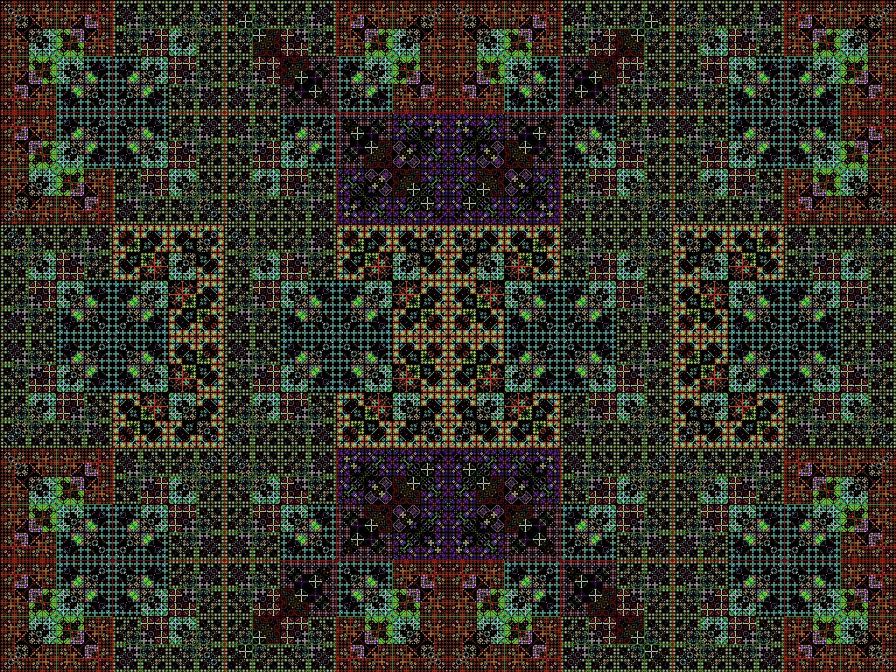



## SetPixel \- Virtual Persian carpet V\. 2

### Description

This is my second Screen Saver an addition to the first Screen saver.

It also draws beautiful pictures as the first Screen Saver but more beautiful than the first Screen Saver

Some of the pictures may look like Carpet's pattern and that's why I called it "Persian Carpets".

I'll be glad to read your comments and advices! I also accept niceaddition for the Screen Saver made by you!
 
### More Info
 

             |
---                |---
**Submitted On**   |2010-10-01 00:49:30
**By**             |[Qwerti60](https://github.com/Planet-Source-Code/PSCIndex/blob/master/ByAuthor/qwerti60.md)
**Level**          |Intermediate
**User Rating**    |5.0 (10 globes from 2 users)
**Compatibility**  |VB 4\.0 \(32\-bit\), VB 5\.0, VB 6\.0
**Category**       |[Graphics](https://github.com/Planet-Source-Code/PSCIndex/blob/master/ByCategory/graphics__1-46.md)
**World**          |[Visual Basic](https://github.com/Planet-Source-Code/PSCIndex/blob/master/ByWorld/visual-basic.md)
**Archive File**   |[SetPixel\_\-2189579302010\.zip](https://github.com/Planet-Source-Code/qwerti60-setpixel-virtual-persian-carpet-v-2__1-73476/archive/master.zip)

